<!-- machine_translated: true -->

<!-- pre-align:aligned sig=2e5f8a3ad55b -->

<a id="foundry-getting-started"></a>
## Machine Learning > NHN Cloud Foundry > Getting Started { #foundry-getting-started }

This document describes the process of uploading and analyzing data in NHN Cloud Foundry, creating an app, and using the results.
After completing the prerequisites (applying for the service and preparing data), learn how to work with data using the basic features, then follow the steps below based on the type of app you want to create.

**Default Features**

1. [Create data source](#basics-datasource)
2. [Make a dataset with a data pipeline](#basics-pipeline)
3. [Analyze with queries, charts, and dashboards](#basics-analytics)

**Recommended System App**

1. Create a data source (using the same method as [Basic Features](#basics-datasource))
2. Create an app
3. Check the app status
4. Retrieve recommendation results
5. Collect recommendation events

**Univariate Time Series Anomaly Detection App**

1. Create a metric data source
2. Transfer metrics
3. Create an app
4. Check detection results

<a id="preparation"></a>
## Prerequisites { #preparation }

<a id="preparation-service-enable"></a>
### Request service { #preparation-service-enable }

To use NHN Cloud Foundry, you must submit a request through [1:1 Inquiry](https://www.nhncloud.com/kr/support/inquiry).

1. Select the organization and project where you want to use the service in the NHN Cloud console.
2. On the **Machine Learning > NHN Cloud Foundry > Status** tab, click the **1:1 Inquiry** button, and submit a request including the resource size that you want.
3. Once the person in charge enables the service for the project, all features become available.

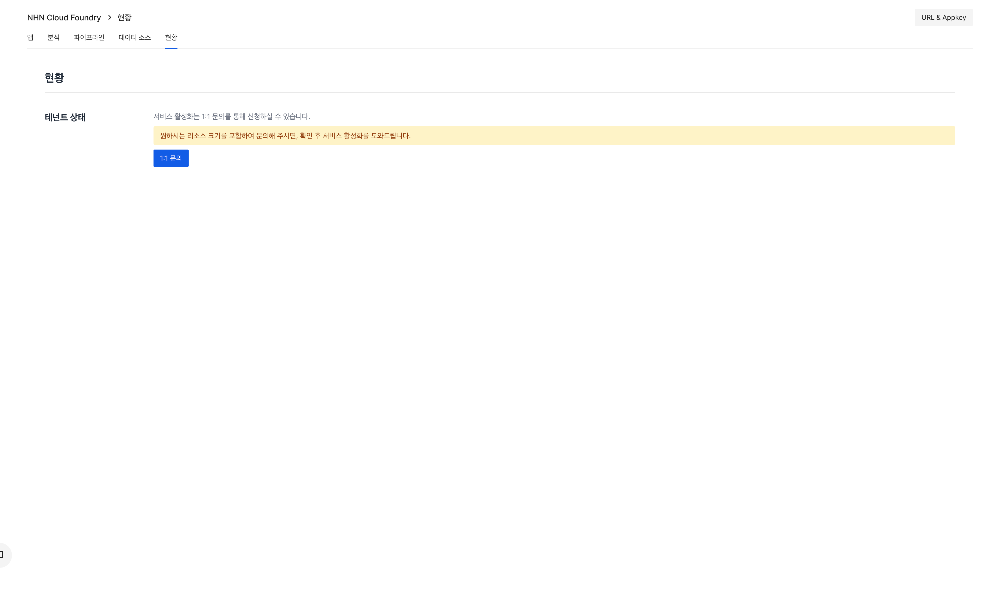{ height="70%" }

<a id="preparation-data"></a>
### Prepare data { #preparation-data }

To create a recommendation system app, you need the following three CSV data files:

| Data | Required columns | Description |
| --- | --- | --- |
| User table | User ID | User information (additional attribute columns are optional) |
| Item table | Item ID | Item information (additional attribute columns are optional) |
| History table | User ID, Item ID, Timestamp | User-item interaction history (rating and category columns are optional) |

The Univariate Time-Series Anomaly Detection app requires metric (time series) data to be sent via the collection API.

The basic features can be followed along with a single CSV file.

<a id="basics"></a>
## Use Basic Features { #basics }

Describes the basic workflow of creating a data source from a CSV file and analyzing the processed dataset using queries, charts, and dashboards through a pipeline.

<a id="basics-datasource"></a>
### 1. Create data source { #basics-datasource }

Go to the **Machine Learning > NHN Cloud Foundry > Data Source** tab.
For detailed descriptions of each setting, see "Create data source" in the [Console User Guide](./console-user-guide/#datasource-create).

1. Click the **Create Data Source** button.

    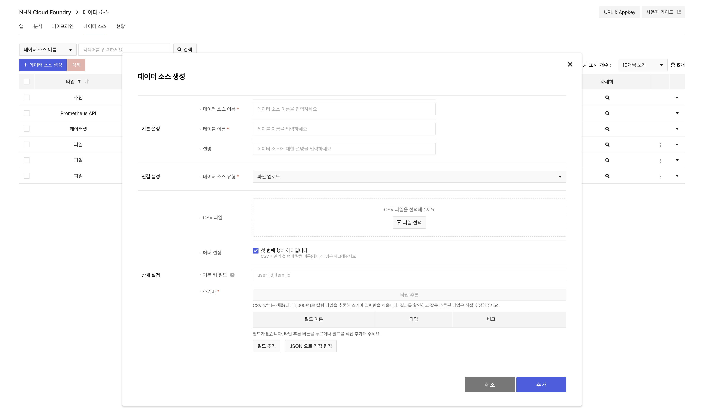{ height="70%" }

2. Enter a data source name and table name in Basic Settings.
3. In connection settings, confirm that the data source type is **File Upload**.
4. In Detailed Settings, click the **Select File** button to select a CSV file.
5. If the first row of the file contains column names, check **First row is header**.
6. The primary key field is automatically set to the first column. If needed, change it to a different column from the drop-down list.
7. Click the **Infer Types** button to automatically populate the schema from a CSV sample. Correct any types that were inferred incorrectly.

    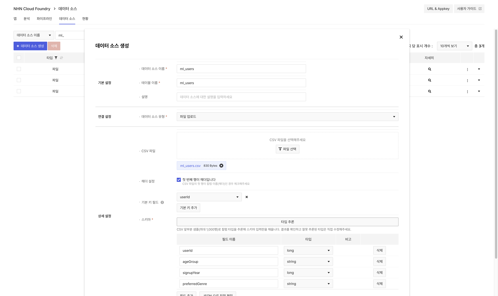{ height="70%" }

6. Click the **Add** button and wait in the list until the status becomes `COMPLETED`.

    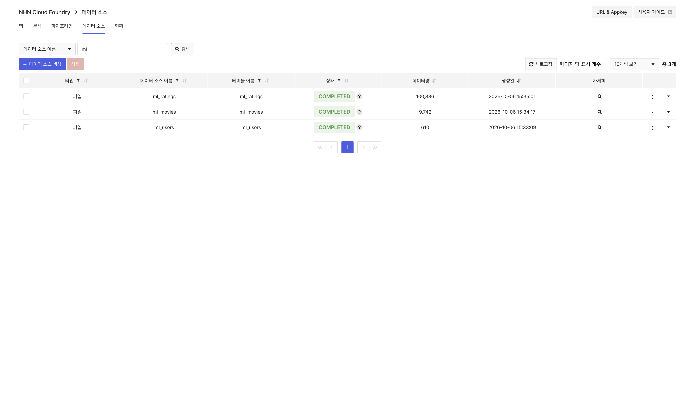{ height="70%" }

!!! tip "Note"
    You can upload CSV files up to 100 MB in size. The data source name and table name cannot be changed after creation, and the table name is used as-is in the FROM clause of subsequent queries.

<a id="basics-pipeline"></a>
### 2. Create a Dataset Using a Data Pipeline { #basics-pipeline }

A pipeline processes data from a data source by connecting it through nodes and saves the result as a dataset.
Go to the **Machine Learning > NHN Cloud Foundry > Pipeline** tab.
For detailed descriptions of each node's settings, refer to "Node Configuration" in the [Console User Guide](./console-user-guide/#pipeline-node).

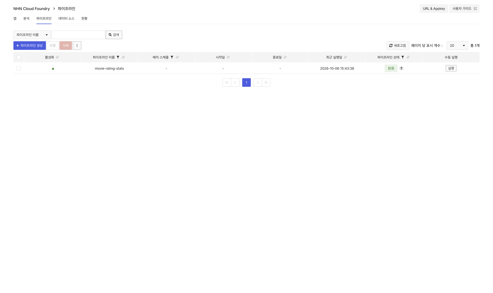{ height="70%" }

1. Click the **Create Pipeline** button.
2. Enter a pipeline name in the settings panel on the right.
3. Click the **Create** button.

    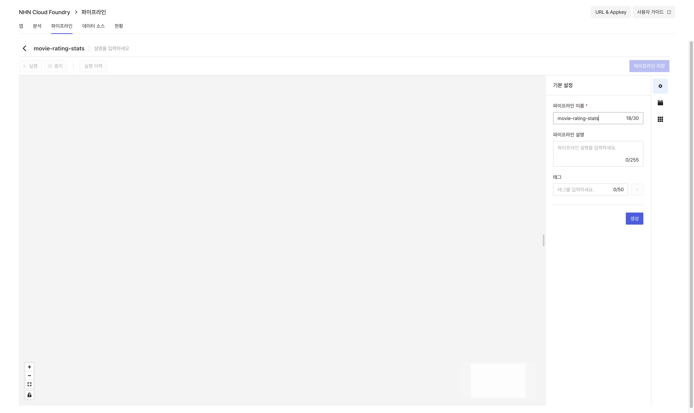{ height="70%" }

4. Click the **Add Source Node** button in the tab bar.
5. Select the data source you created in "1. Create a Data Source."
6. Click the **Add Data Source** button.
7. Click the source node on the canvas. The **Transform**, **Join**, **Union**, and **Dataset** buttons appear on the node.
8. Click **Transform** and select the transformation type. For example, **Filter** keeps only rows that match a condition, and **Aggregate** aggregates data using grouping criteria and aggregation functions.
9. Enter a node name and settings, then click the **Add Transform Node** button. The added node is automatically connected after the selected node.
10. Click the last transform node and click **Dataset**.
11. Enter a dataset name and click the **Add Dataset Node** button.

    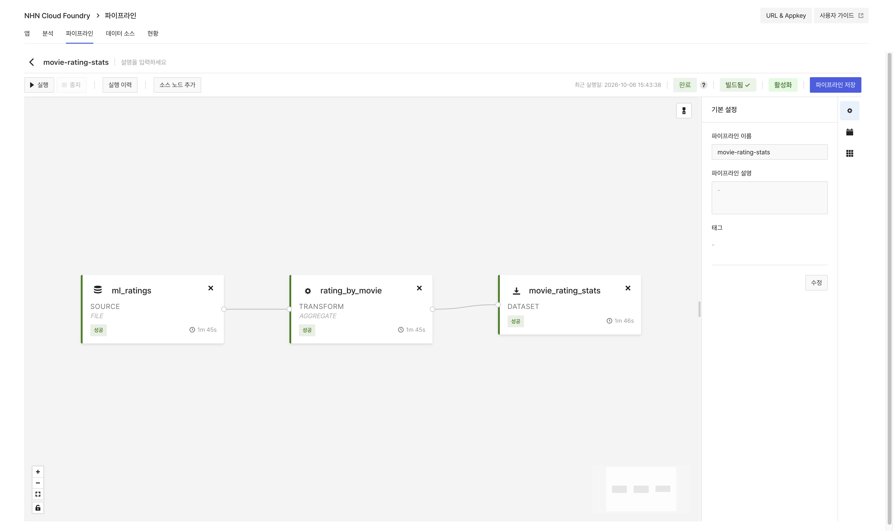{ height="70%" }

12. Click the **Save** button.
13. Click the **Run** button in the tab bar.
14. Click **Run** in the confirmation dialog. On the first run, the build and execution proceed together.
15. When the status badge shows **Completed**, the run is finished. You can check the run details for each node by clicking the **Run History** button.

    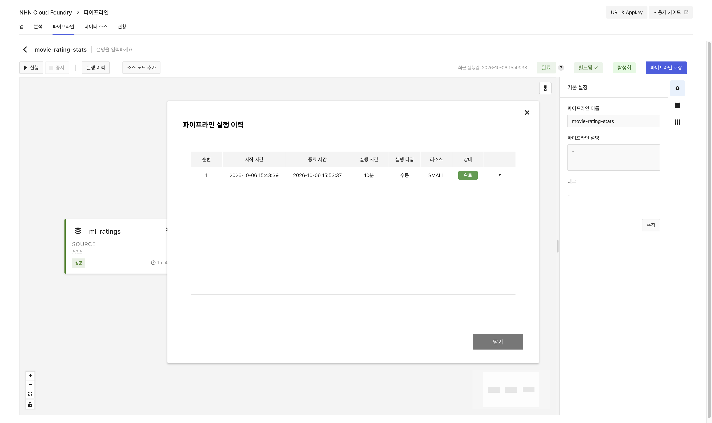{ height="70%" }

When the run is complete, a data source with the type **Dataset** is created in the data source list under the name specified in the dataset node.
For detailed descriptions of how to run a pipeline, refer to "Pipeline Run" in the [Console User Guide](./console-user-guide/#pipeline-run).

!!! tip "Note"
    Pipelines are available when the resource size is MEDIUM or larger. Because a dataset name is used as both a data source name and a table name, it must contain only lowercase English letters, numbers, and `_`, and must not conflict with an existing data source name.

<a id="basics-analytics"></a>
### 3. Analyze with Queries, Charts, and Dashboards { #basics-analytics }

On the **Machine Learning > NHN Cloud Foundry > Analysis** tab, you can query data sources and datasets using SQL, and visualize the results with charts and dashboards.

**Run a query**

1. On the **Query** tab, select a **Data Source**. You can check field names and data types in the schema panel on the right side of the query input area.
2. Write SQL in the query input area. In the FROM clause, use the table name exactly as it appears in the data source list (for example, `SELECT * FROM {table name}`).
3. Click the **Run Query** button or press **Ctrl+Enter** (or **⌘+Enter** on macOS) to display the results in a data grid.

    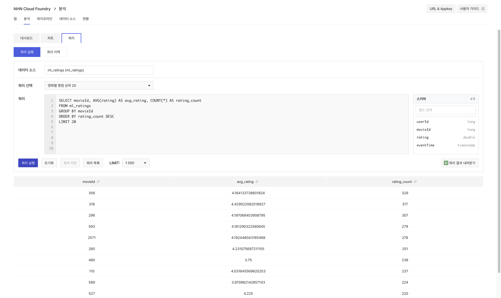{ height="70%" }

**Create a chart**

1. On the **Chart** tab, click the **Create Chart** button.
2. In the basic settings, enter a chart name and select a chart visualization type (for example, **Line Chart**).
3. In the data source settings, select the data source type (for example, **DATASET**) and the data source name.
4. In the query settings, specify the X-axis (time axis), aggregation interval, and reference time, then add the target column and aggregation function under Columns.
5. Click the **UPDATE CHART** button to check the preview, then click the **Create** button in the header.

    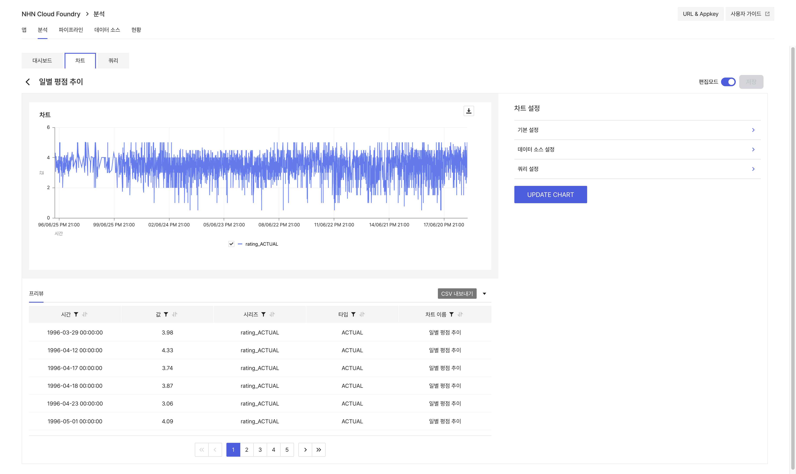{ height="70%" }

**Configure a dashboard**

1. On the **Dashboard** tab, click the **Create Dashboard** button and enter a dashboard name.
2. On the **CHARTS** tab in the edit panel, click or drag the chart card you created earlier onto the canvas.
3. Drag the chart on the canvas to reposition it, and drag the corners to resize it.
4. Click the **Save** button in the header. You can view the dashboard in detail by clicking it in the dashboard list.

    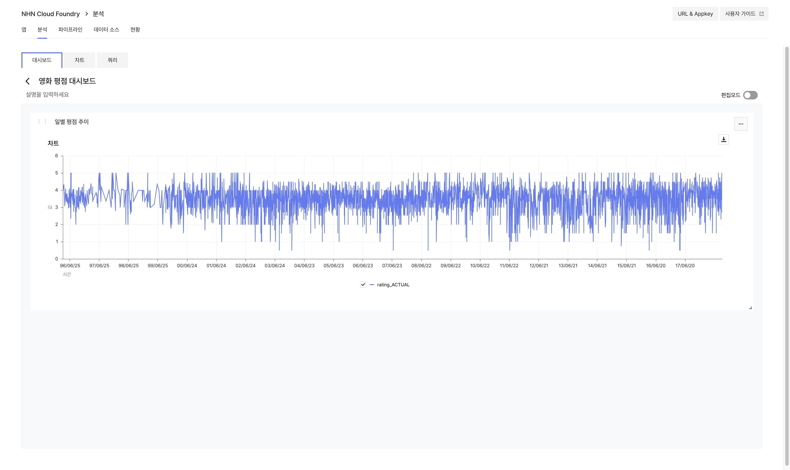{ height="70%" }

For detailed descriptions of each item, see "Analysis - Query" in the [Console User Guide](./console-user-guide/#query), "Analysis - Chart" in the [Console User Guide](./console-user-guide/#chart), and "Analysis - Dashboard" in the [Console User Guide](./console-user-guide/#dashboard).

!!! tip "Note"
    Only SELECT queries can be executed. Because the required query settings differ by chart visualization type, refer to "Query Settings" in the [Console User Guide](./console-user-guide/#chart-create-query) for types other than Line Chart.

<a id="recommendation"></a>
## Create a Recommendation System App { #recommendation }

You can use a recommendation system app to train a recommendation model with user, item, and interaction data and receive results through the recommendation API.

<a id="datasource-create"></a>
### 1. Create a data source { #datasource-create }

Create **User**, **Item**, and **History** data sources in the same way as described in "1. Create data source" in [Basic Features](#basics-datasource).
Wait until the status of all three data sources in the list becomes `COMPLETED`.

<a id="app-create"></a>
### 2. Create an app { #app-create }

Go to the **Machine Learning > NHN Cloud Foundry > Apps** tab and click the **Create app** button.
For a detailed description of each setting, see 'Create an app' in the [Console User Guide](./console-user-guide/#app-create).

<a id="app-create-basic"></a>
#### Basic Settings { #app-create-basic }

Enter the app name and description, select **Recommendation system** as the app type, and click **Next**.

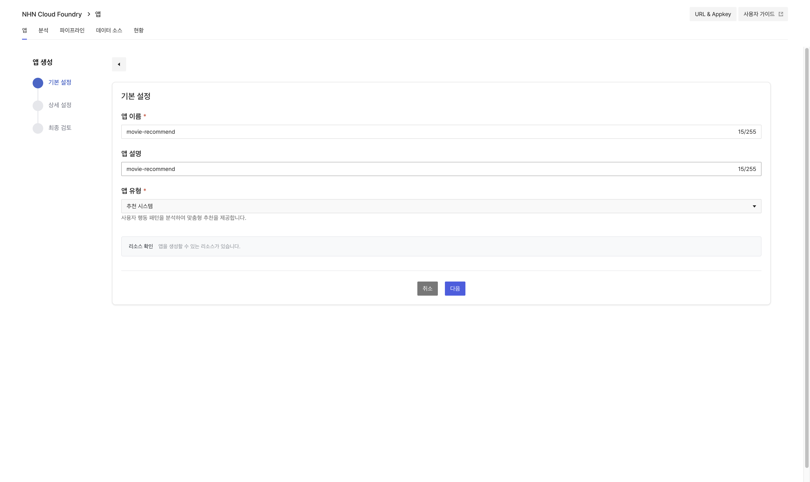{ height="70%" }

<a id="app-create-detail"></a>
#### Detailed Settings { #app-create-detail }

1. Click the **Add model** button to add the model to use. For a new service, we recommend the **Cold User** model; if you have sufficient user behavior history, use **Warm User (Transformer)**.

    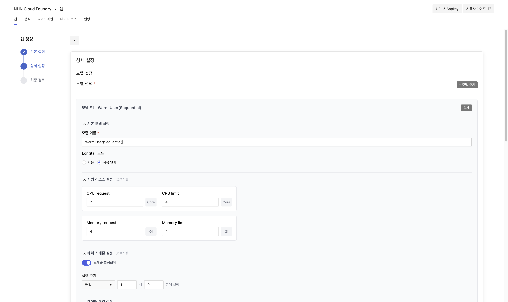{ height="70%" }

2. In **Data connection settings** on the model card, select the user, item, and history data sources that you created in step 1.
   Specify the user ID and item ID columns and the timestamp column in the history. Select feature columns only when needed.

    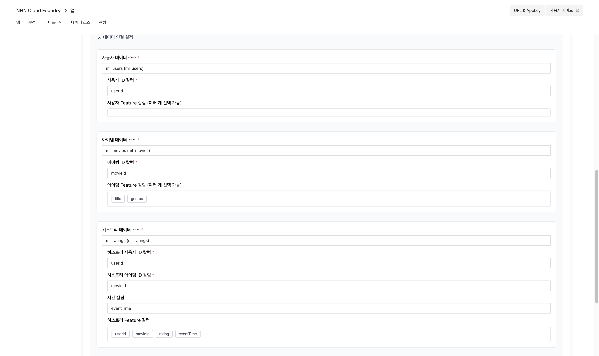{ height="70%" }

3. If necessary, connect skill tables and other resources in **Additional settings (Skills)**. Set the Longtail mode in the basic model settings (this includes items with lower popularity in recommendations). When done, click **Next**.

    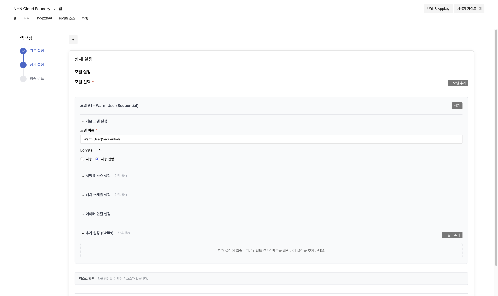{ height="70%" }

<a id="app-create-review"></a>
#### Final Review { #app-create-review }

1. Review the basic settings, model settings, and additional settings that you entered.
2. Click the **Save** button to create the app.

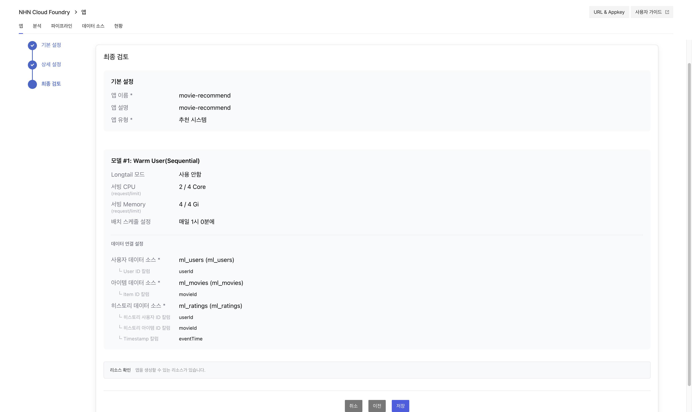{ height="70%" }

<a id="app-status"></a>
### 3. Check the app status { #app-status }

After the app is created, training and deployment proceed automatically. The status changes through Initializing, Training, Deploying, and Activating before reaching Active.
Wait until the status in the app list changes to Active.

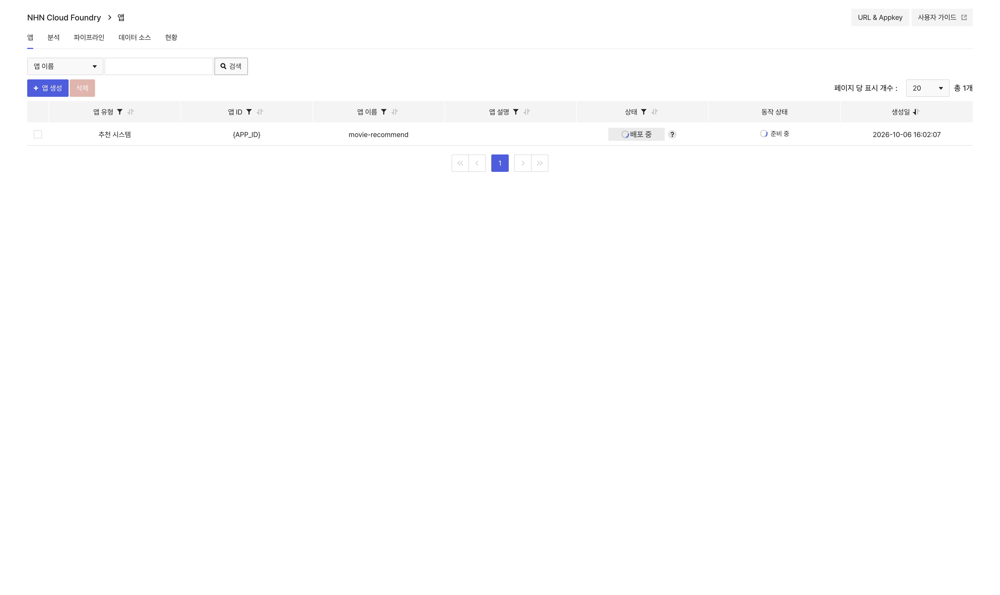{ height="70%" }

For a detailed description of each status value, see 'App status' in the [Console User Guide](./console-user-guide/#app-list-status).

!!! tip "Note"
    Training and deployment immediately after app creation is the process of preparing the app. The first training of the recommendation model runs at the time specified in the batch schedule settings. Until then, even if the recommendation API returns a response, it does not reflect the recommendations of a trained model.

<a id="recommendation-query"></a>
### 4. Retrieve recommendation results { #recommendation-query }

When the app becomes active, you can check recommendation results on the recommendation API call screen in the console, or retrieve recommendation results by calling the recommendation query API.
For a detailed description of each item, see 'Call recommendation API' in the [Console User Guide](./console-user-guide/#app-detail-recommend).

1. In the app list, click the app that you created to go to the **Call recommendation API** tab on the details screen.
2. Enter the user ID and specify the recommendation mode and maximum number of recommendations.
3. Click the **Request recommendations** button to display the rank, item key, and score in the recommendation results. You can also check the total number of results and the response time.

    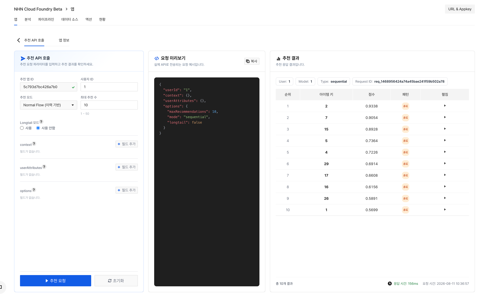{ height="70%" }

**Request preview** displays the actual API request JSON composed of the input values. You can copy it using the **Copy** button and use it for API integration development.
For instructions on directly calling the recommendation query API, see 'Recommendation query API' in the [API Guide](./api-guide/#recommendation-api).

The response includes the request identifier (`metadata.requestId`) and the list of recommended items (`recommendations[].itemKey`). These values are used when sending recommendation events in the next step.

On the **App info** tab, you can check the app ID, status, and version used for API calls.

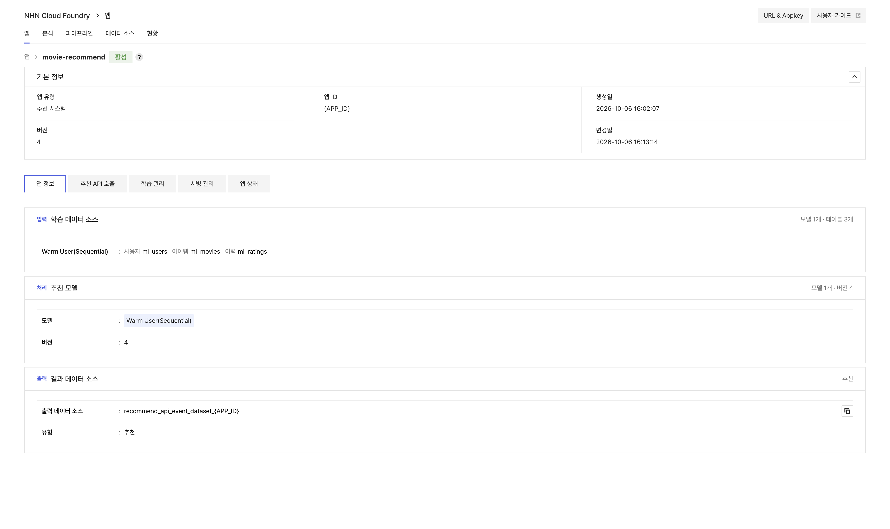{ height="70%" }

<a id="recommendation-event"></a>
### 5. Collect recommendation events { #recommendation-event }

When a user interacts with recommendation results, such as clicking on them, send the event data using the recommendation event API. You can analyze the recommendation success rate using the accumulated event data.
For a detailed description of each request field, see 'Recommendation event API' in the [API Guide](./api-guide/#recommendation-event-api).

```bash
curl -X POST '{URL}/api/v1.0/recommendation-apps/{APP_ID}/events' \
  -H "X-NC-APP-KEY: {APP_KEY}" \
  -H "Content-Type: application/json" \
  -H "X-NHN-Authorization: {AUTH_TOKEN}" \
  -d '{
    "eventType": "CLICK",
    "requestId": "{RecommendApiResponse.body.metadata.requestId}",
    "itemKey": "{RecommendApiResponse.body.recommendations.itemKey}",
    "userId": "{RecommendApiResponse.body.userId}",
    "context": {
      "position": 1,
      "placement": "home_main"
    }
  }'
```

!!! tip "Note"
    After an event API request, it may take up to 10 minutes for the data to be loaded into the dataset.

<a id="univariate"></a>
## Create a Univariate Time Series Anomaly Detection App { #univariate }

To automatically detect values that fall outside the normal range in a metric, use the Univariate Time-Series Anomaly Detection app.

<a id="univariate-datasource"></a>
### 1. Create a Metric Data Source { #univariate-datasource }

On the **Machine Learning > NHN Cloud Foundry > Data Source** tab, click the **Create Data Source** button.

1. In Default Setting, enter the data source name and table name.
2. In Connection Settings, select **Prometheus API** as the data source type.
3. In the detailed settings, specify the series identification label and group label.
    - The schema is fixed, so do not enter it manually.
    - In **Preview**, you can check how many series and groups are divided by the labels you entered.
4. Click the **Add** button and wait until 'Ready.' appears in the completion window.
    - The completion window also displays the collection method (endpoint, request header, request body example, and rule).
    - In the list, the status is displayed as `COMPLETED`.

    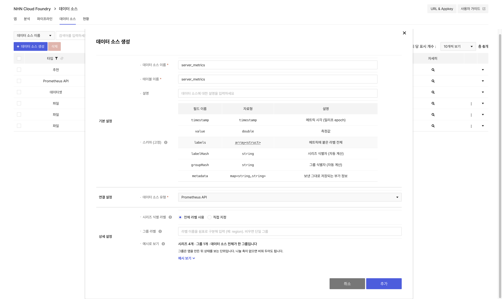{ height="70%" }

For a detailed description of each field, refer to the 'Prometheus API Detail Settings' section in the [Console User Guide](./console-user-guide/#datasource-create-detail-prometheus).

<a id="univariate-ingest"></a>
### 2. Send Metrics { #univariate-ingest }

From the **Metric Collection** tab in the Data Source Created window or the Details view, use the **Copy** button to copy the endpoint, request headers, and request body examples, then send the metrics. For the authentication token field in the request header, enter the token that you issued.

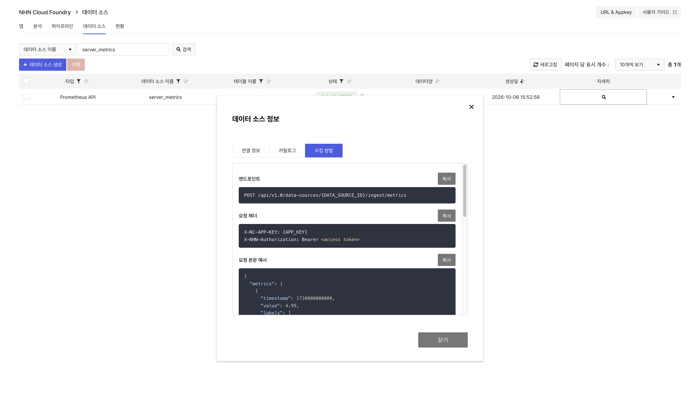{ height="70%" }

```bash
curl -X POST '{URL}/api/v1.0/data-sources/{DATA_SOURCE_ID}/ingest/metrics' \
  -H "X-NC-APP-KEY: {APP_KEY}" \
  -H "X-NHN-Authorization: {AUTH_TOKEN}" \
  -H "Content-Type: application/json" \
  -d '{
    "metrics": [
      {
        "timestamp": 1776149886528,
        "value": 4.99,
        "labels": [
          { "name": "__name__", "value": "cpu_usage" },
          { "name": "instance_id", "value": "instance-001" }
        ]
      }
    ]
  }'
```

For a detailed description of the request format, see "Metric Collection" in the [API Guide](./api-guide/#metrics-ingest-api).

!!! tip "Note"
    After creating an app, send metrics of the same time series one per minute without interruption. If you send them at longer intervals, gaps will occur and the system may not finish preparing in exact mode. If you send multiple values within 1 minute, only the first value received is used. If you collect data at a shorter interval, aggregate the values into a 1-minute average before sending.

<a id="univariate-app"></a>
### 3. Create an App { #univariate-app }

On the **Machine Learning > NHN Cloud Foundry > App** tab, click the **Create App** button.

In the default settings, enter the app name and description, and select **Univariate Time Series Anomaly Detection** as the app type.

    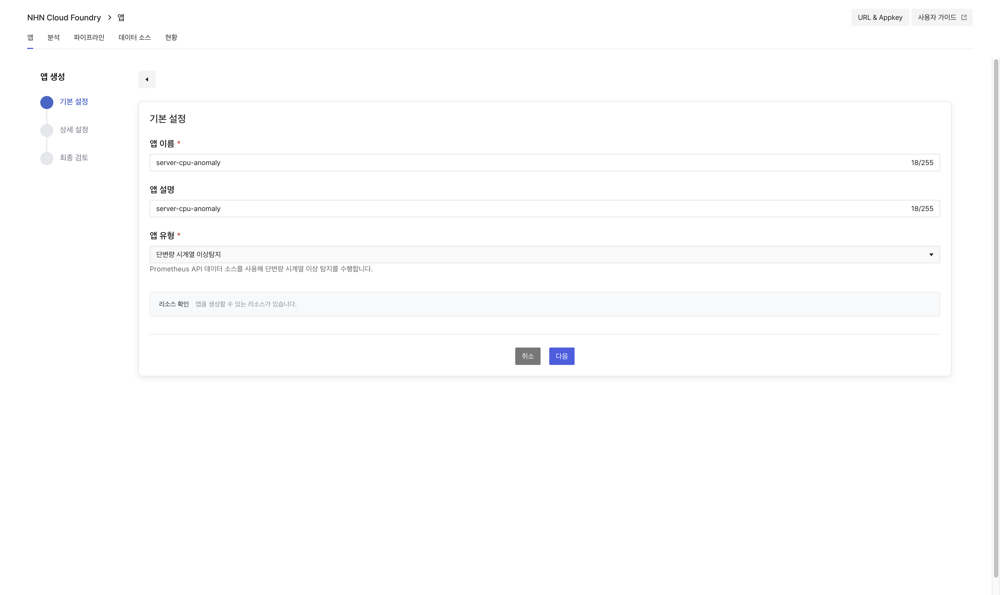{ height="70%" }

2. In the detailed settings, select the metric data source that you created earlier.
    - Specify the model resources, retraining cycle, detection options, and result transmission.
    - If you do not specify a retraining cycle, training is performed only once when the app is created. In this case, you cannot create an app with a data source that has no data, so send the metrics first.

    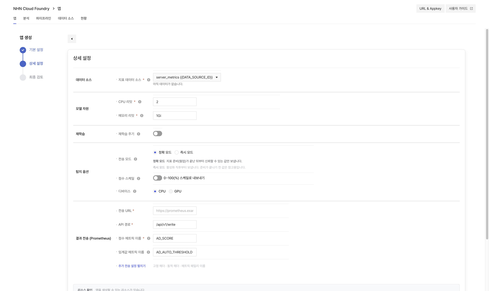{ height="70%" }

3. In the final review, check the entered information and click the **Save** button.
    - The completion window displays the estimated time for the training and deployment process and results to appear. Continue sending metrics during this time.

For more details on each item, see "Detailed Settings for Univariate Time Series Anomaly Detection" in the [Console User Guide](./console-user-guide/#app-create-detail-univariate).

!!! tip "Tips"
    You can create only one univariate time-series anomaly detection app per metric data source. We recommend using the default Exact mode for the result transmission mode. If you want to receive values immediately before preparation is complete, select Instant mode.

<a id="univariate-result"></a>
### 4. Check Detection Results { #univariate-result }

Click the app you created in the app list to go to the details screen.

1. On the **App Info** tab, check the training status and group status.

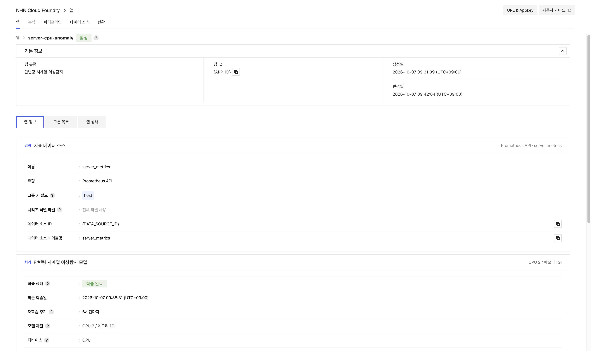{ height="70%" }

2. On the **Group List** tab, check the group status.
    - If you did not specify a group label, one group is registered when app creation is complete. The list is empty while it is being created.
    - Activation Pending means data for evaluation is being collected; once active, detection results are sent.
    - In the Detection start time column, you can check when each group started sending results.
    - In the inference status column, check whether inference is running normally.

    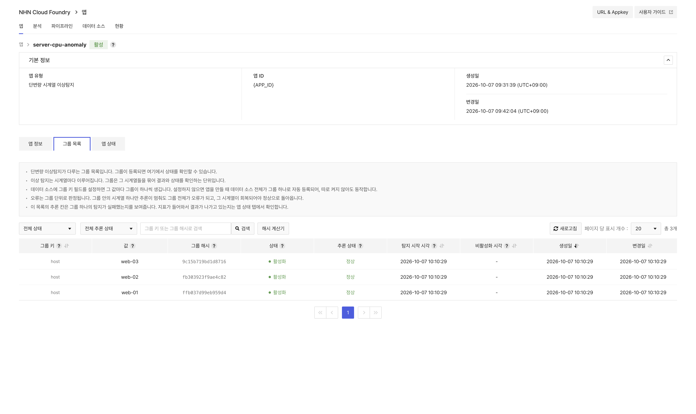{ height="70%" }

3. The anomaly score and threshold, which are the detection results, are sent to the specified Prometheus and also stored in the result data source.
4. View the stored results using queries or charts on the **Analysis** tab.

For more information on each item, see "Univariate Time Series Anomaly Detection App Details" in the [Console User Guide](./console-user-guide/#app-detail-univariate).